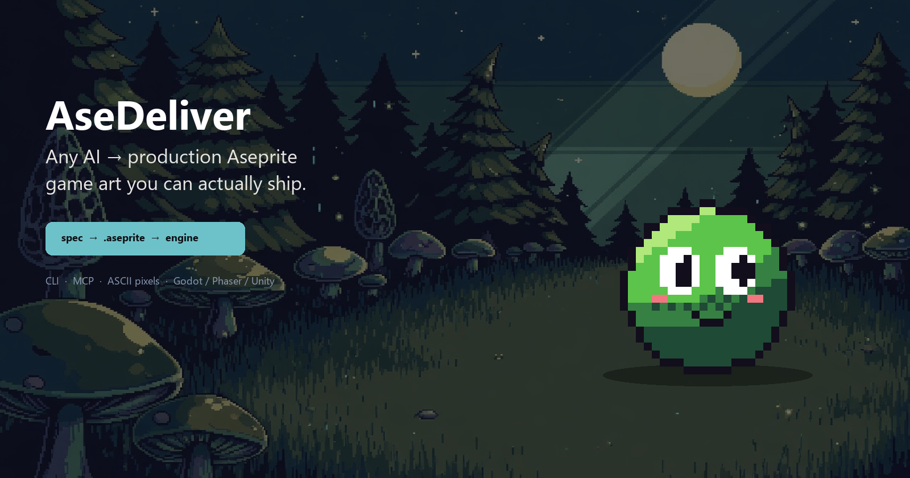
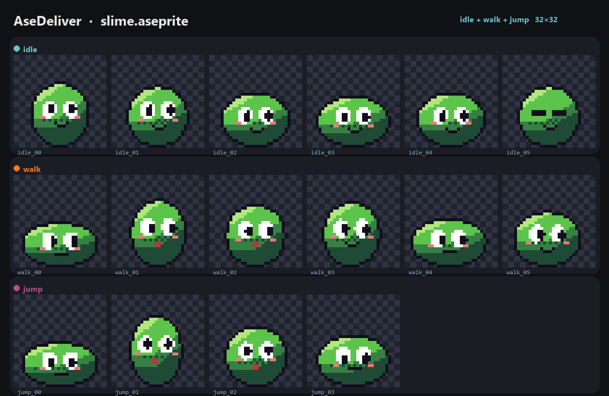
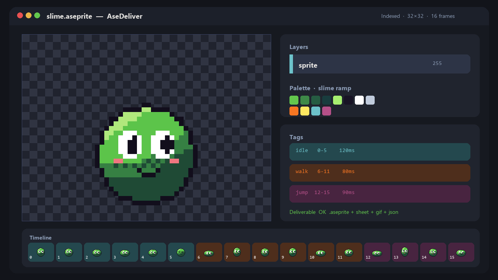
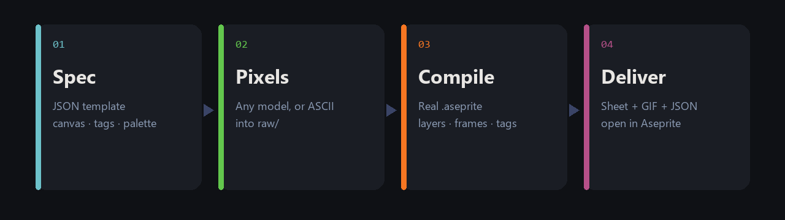
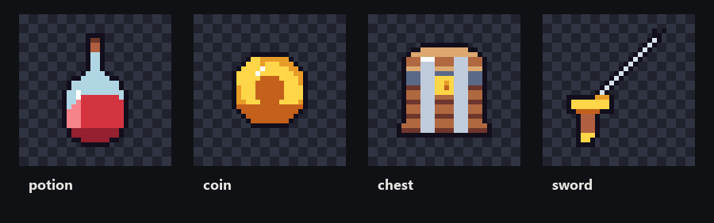

<p align="center">
  
</p>

<p align="center">
  <strong>AseDeliver</strong> · 任意 AI 都能给用户交出一份能在 Aseprite 里打开、能进游戏的像素原画<br>
  <sub>CLI · MCP · ASCII pixels · Godot / Phaser / Unity</sub>
</p>

<p align="center">
  <a href="https://ylty1516.github.io/ase-deliver/"></a>
  <a href="LICENSE"></a>
  <a href="https://www.aseprite.org/"></a>
</p>

---

没有 `.aseprite` 就不算交货。AseDeliver 是「AI 画了一张图」和「游戏能用」之间缺的那一层编译器。

图像模型可以换。交付合同不变。

## 展示

史莱姆示例是工具自己画的 32×32 成品（描边、四档明暗、idle / walk / jump），已用官方 **Aseprite 1.3.18.2** 打开验证。

<p align="center">
  
</p>

<p align="center">
  
  &nbsp;&nbsp;
  
  &nbsp;&nbsp;
  
</p>

<p align="center">
  
</p>

<p align="center">
  
</p>

<p align="center">
  
</p>

看完整页面（大图 + 动图）：**[ylty1516.github.io/ase-deliver](https://ylty1516.github.io/ase-deliver/)**

## 它产出什么

| 文件 | 作用 |
|---|---|
| `out/<name>.aseprite` | 源文件：图层、帧、Tag、调色板、pivot |
| `out/<name>.png` | 精灵表 |
| `out/<name>.gif` | 预览 |
| `out/<name>.json` | 引擎用 frame + frameTags |

## 任意 AI 怎么用

1. `init` 一个模板项目  
2. `brief` — 按它列出的文件名画（任何模型，或 ASCII）  
3. 文件放进 `raw/`  
4. `build`  
5. `validate` 的 `deliverable` 必须为 true  
6. `open` 到 Aseprite  

完整合同见 [`AGENTS.md`](AGENTS.md)。Grok / Claude / Cursor / Codex 直接读这一份即可。

```bat
git clone https://github.com/ylty1516/ase-deliver.git
cd ase-deliver
py -3 -m venv .venv
.venv\Scripts\python.exe -m pip install -r requirements.txt

ase-deliver.bat demo --out examples\slime --open
ase-deliver.bat init hero --template character-platformer --desc "side-view fox knight"
ase-deliver.bat brief hero
ase-deliver.bat build hero
```

Linux / macOS：

```bash
python -m venv .venv
source .venv/bin/activate
pip install -r requirements.txt
PYTHONPATH=. python -m ase_deliver demo --out examples/slime
```

## 模板

| id | 画布 | tags |
|---|---|---|
| `character-platformer` | 32×32 | idle, walk, jump |
| `character-topdown` | 16×16 | 四向走 |
| `character-turnaround` | 64×64 | front / 3/4 / side / back |
| `portrait` | 80×80 | bust |
| `prop` | 32×32 | idle |
| `tileset-16` | 16×16 | grass, dirt, stone, water |
| `ui-button` | 48×16 | normal, hover, pressed |
| `fx` | 32×32 | burst |

## MCP

任意 MCP 客户端：

```json
{
  "mcpServers": {
    "ase-deliver": {
      "command": "python",
      "args": ["-m", "ase_deliver", "mcp"],
      "env": { "PYTHONPATH": "/path/to/ase-deliver" }
    }
  }
}
```

工具：`init_project` · `generation_brief` · `paint_cel` · `build` · `validate_sprite` · `open_in_aseprite`

## 硬规则（给模型）

- 主体孤立，背景 `#FF00FF` 或已透明，不要地面、投影、水印、文字
- 站立姿态脚踩画布底边
- 同一角色跨帧：比例、颜色、pivot 锁定
- 循环动画必须能 loop
- 不要发明文件名，以 `brief` 为准

没有图像模型时：

```json
{ "map": { ".": null, "#": "#63c74d" }, "rows": ["....", ".##.", ".##.", "...."] }
```

`ase-deliver paint <project> --tag idle --frame 0 --file pixels.json`

## License

MIT
